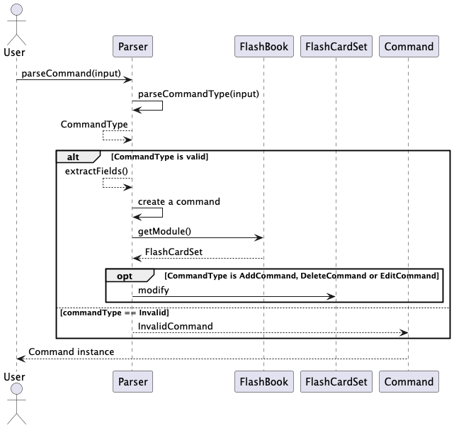
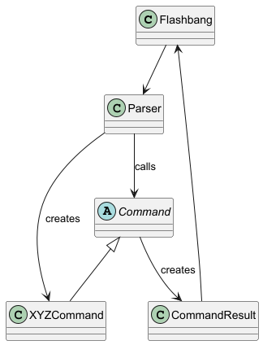
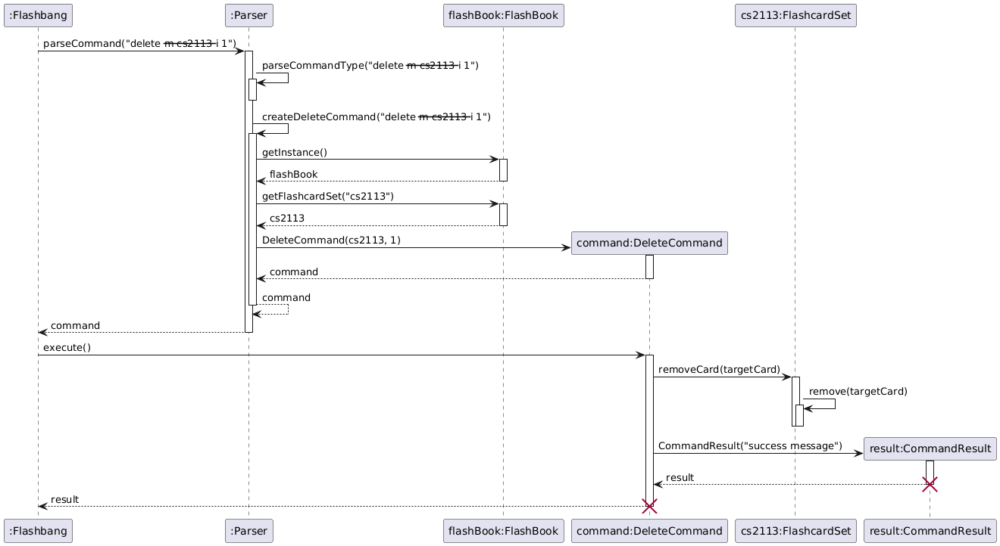
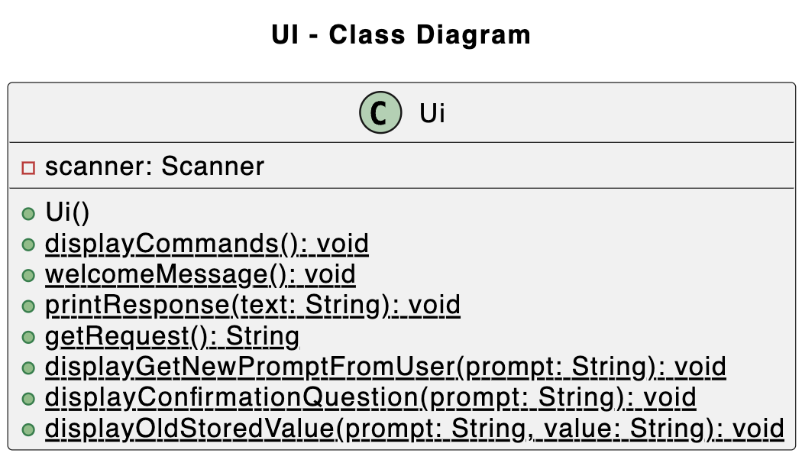
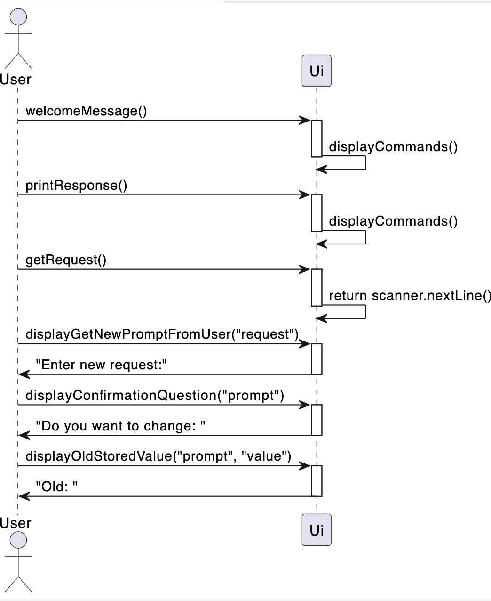
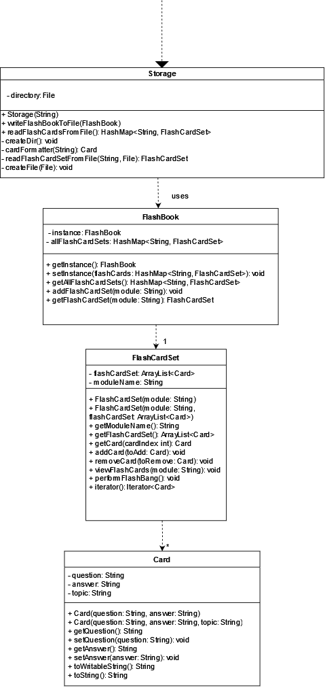
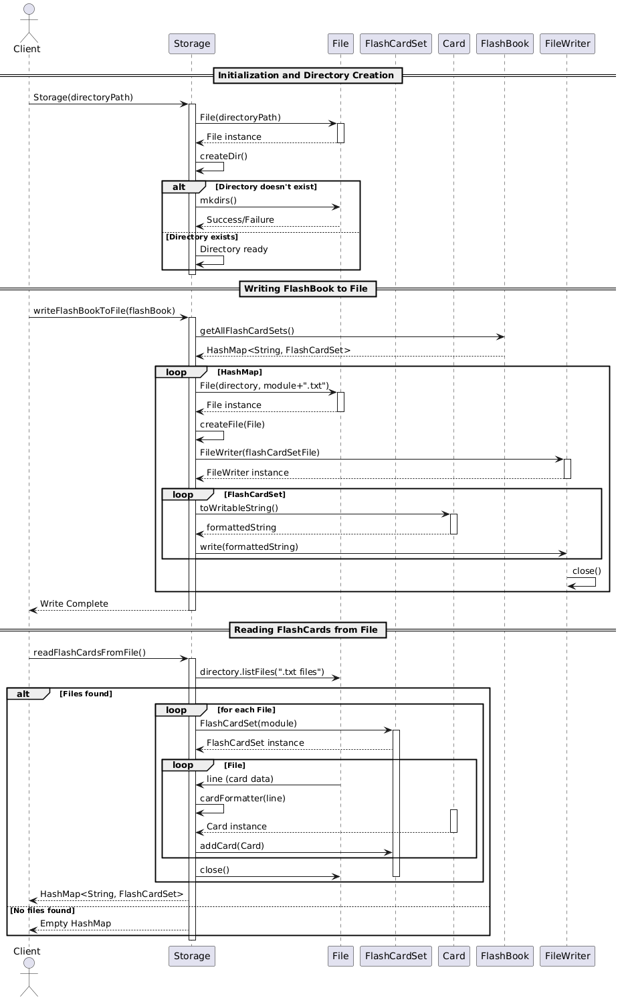
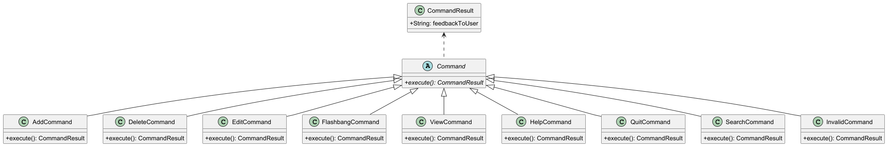
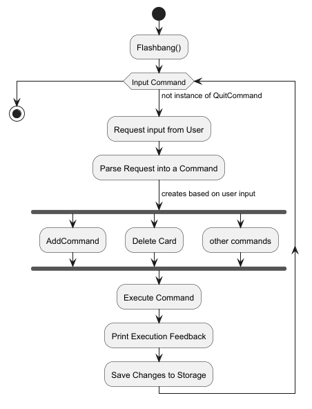

# Developer Guide

## Acknowledgements

{list here sources of all reused/adapted ideas, code, documentation, and third-party libraries -- include links to the original source as well}
Formatting of Developer's Guide was done with reference to [AddressBook-Level3 developer guide](https://se-education.org/addressbook-level3/DeveloperGuide.html#common-classes).

## Design & implementation

{Describe the design and implementation of the product. Use UML diagrams and short code snippets where applicable.}

### Parser component
API: `Parser.java`

Parser's role is to given user input create a command which then can be executed. This particular implementation follows 
**Factory design pattern**. It exposes a general purpose method for parsing command `parseCommand(String input)` and then it determines
command types and creates one of the type. Regular expressions are heavily used for extracting information from input.
More details are presented on a sequence diagram someName.

#### Alternative approaches/Possible improvements:
- Command factory could be moved to a separate class 
- Creating a lexer object might be a desirable approach if the commands where much more complex

#### Structure
Below is a partial class diagram showing the interactions of the `Parser` class.

The sequence diagram below illustrates the interactions taking `parseCommand(“delete --m cs2113 --i 1”)` as an example.

#### Example
How the `Parser` component works:
The `Parser` receives the command input.
It identifies the command type using `parseCommandType`.
Depending on the command type, it creates the corresponding command object (e.g., `AddCommand`).
The created command is executed, producing a `CommandResult`.
The `CommandResult` is then used by `Ui` to provide feedback to the user.

### Ui component
API: `Ui.java`

Below is a particular class diagram showing the interactions of the `Ui` class. 
 

The sequence diagram below illustrates the interactions between the user and this class when the program is executed. 

How the `Ui` component works: 
The `Ui` serves as a centralized utility that handles all outputs. 
When a user execute the app, this class displays the welcome message and all available commands. After that, based on users' inputs, it handles the output that is processed by other classes. 

### Storage component
API: `Storage.java`

Below is a class diagram showing the interactions of the `Storage` class.

The sequence diagram below illustrates the interactions taking `writeFlashBookToFile()` and  `readFlashCardsFromFile()`.

How the `Storage` component works:
 The `Storage` component is initialized with a directory path where flashcard data will be stored.
    To save data:
        `writeFlashBookToFile()` is called, iterating through each `FlashCardSet` in `FlashBook`.
        For each `FlashCardSet`, a corresponding file is created in the directory, and each Card in the set is written to this file.
    To load data:
        `readFlashCardsFromFile()` checks the directory for flashcard files.
        For each file found, `readFlashCardSetFromFile()` is called to read the cards and create a `FlashCardSet`.
        The `FlashCardSet` is then added back to the `FlashBook`, reconstructing the flashcard library in memory.

### Command Structure
API: `commands`

Below is a class diagram to showcase the class structure of the `Command` classes

This class diagram shows how the `Command` classes are used to generate independent behaviour for each of the commands.
The use of an abstract class `Command` that all the commands inherit from is to utilise polymorphism in the main loop
such that all an instance of any command can be called and executed to perform each commands function. For example, when
the user inputs `add --m CS2113 --q What is OOP? --a Object-Oriented Programming` an instance of an `AddCommand` will be
created which is then executed creating a CommandResult object.
 
 
This behaviour is modelled in the Activity Diagram below:

## Product scope
### Target user profile

- Has a need to create flashcards for their studies
- Needs to be able to test themselves on flashcard content
- Needs to be able to track how well they understand the modules they take
- Can type fast
- Prefers typing to mouse interactions
- Is used to using CLI applications

### Value proposition

Give university students a simple and effective flashcard application which allows them to create flashcards for the
many modules and topics they have for schools. Flashcards are used to test the student's knowledge and also organise the
content of the module in a simple and clear way.

## User Stories

| Version | As a ... | I want to ...                                             | So that I can ...                                                                |
|---------|----------|-----------------------------------------------------------|----------------------------------------------------------------------------------|
| v1.0    | new user | see usage instructions                                    | refer to them when I forget how to use the application                           |
| v1.0    | student  | view existing flashcards                                  | test my knowledge to study efficiently                                           |
| v1.0    | student  | view existing flashcards                                  | review and learn material                                                        |
| v1.0    | crammer  | delete flashcards which im confident at                   | focus on my areas of weakness                                                    |
| v1.0    | student  | review flashcards that I have answered incorrectly        | identify my knowledge gaps                                                       |
| v2.0    | student  | have a timer within the app                               | able to time myself taking the quizzes within the app itself for better learning |
| v2.0    | student  | view all incorrect flashcards in previous quizzes         | focus more on my weak areas                                                      | 
| v2.0    | user     | search for flashcards based on keyword and module         | test myself on specific topics                                                   |
| v2.0    | student  | keep track of how many right and wrong answers in quizzes | focus on how well versed I am in a topic                                         |
| v2.0    | student  | filter flashcards by difficulty                           | choose which ones to focus on based on my current level of understanding         |
## Non-Functional Requirements

* Should work on any mainstream OS as long as it has Java `17` or above installed
* Should be able to handle any number of modules as long as there are no repeated module names
* A user with strong typing ability should be able to use the application faster than with a mouse

## Glossary

* **Flashcard** - a card containing a small amount of information as an aid to learning.
Contains a question and an answer related to a topic.

## Instructions for manual testing

### Launch and shutdown
#### Initial launch
1. Download the jar file and copy into an empty folder
2. Open the jar file using your command line with the command:
`java -jar {Path of File}`
#### Shutdown
1. Type `quit` to exit the application
2. Quitting the application also saves all changes made by the user during runtime  
Expected: Application exits and the text files in `./data` are updated accordingly
#### Adding Flashcards
1. Adding flashcards into the flash book
   1. Test case: `add --m CS2113 --q What is OOP? --a Object-Oriented Programming`  
    Expected: A Card with question "What is OOP" and answer "Object-Oriented Programming" in the module "CS2113"
   2. Test case: `add`  
   Expected: An error is thrown and caught printing out "uh oh bad command"
   3. Other incorrect add commands to try: `add --q`, `add --a` (with missing fields or empty fields)  
   Expected: Similar to previous
#### Deleting Flashcards
##### Prerequisites: There are a several flashcards in the flash book listed out using the view command
1. Deleting flashcards from the flash book
   1. Test case: `delete --m CS2113 --i 1`  
   Expected: the first flashcard in the CS2113 flash card set is deleted. Details of the deleted card should be shown
   2. Test case: `delete`  
   Expected: An error is thrown and caught printing out "uh oh bad command"
   3. Other incorrect variations to try: `delete --m ModuleNotInList --i 0`, `delete --m` 
   (with missing fields or modules not in the flash book)  
   Expected: Similar to previous
#### Flashbang
##### Prerequisites: There are a several flashcards and flashcard sets in the flash book
1. Quizzing users on the flashcards in a module
   1. Test case: `flashbang --m CS2113`  
   Expected: Each question within the module is displayed sequentially 
   where users are prompted to reveal the answer to the question with `y` or `n` 
   2. Incorrect variation to try: `flashbang`, `flashbang --m`  
   Expected: An error is thrown and caught printing out "uh oh bad command"
   3. Other incorrect variations to try: `flashbang --m ModuleNotInList`  
   Expected: An error is thrown and caught printing out "uh oh bad command"
