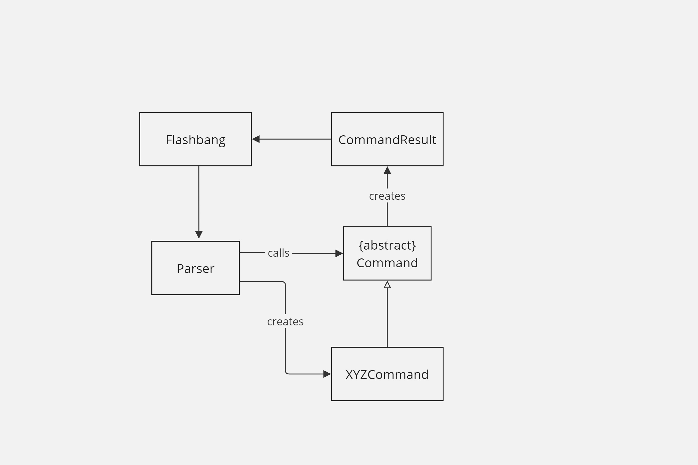

# Project Portfolio Page (PPP)

## Overview
**FlashBang** is a CLI app designed to provide students with a smart way of studying for their modules. The app will manage a limited number of flashcards for a small number of modules, optimized for users who prefer a CLI.

## Summary of Contributions

### Code Contributed
[RepSense Link](https://nus-cs2113-ay2425s1.github.io/tp-dashboard/?search=raneeng&breakdown=true&sort=groupTitle%20dsc&sortWithin=title&since=2024-09-20&timeframe=commit&mergegroup=&groupSelect=groupByRepos&checkedFileTypes=docs~functional-code~test-code~other)

### Enhancements Implemented
1. **Command Classes:**
    - **How**: Implemented classes such as `AddCommand`, `DeleteCommand`, `FlashBangCommand`, etc.

2. **Command Class Testing:**
    - **How**: Used JUnit framework to write tests covering different scenarios and edge cases.

3. **Show FlashBang Percentage:**
    - **How**: Added methods to calculate and display the percentage based on user performance.

4. **Show FlashBang Mistakes:**
    - **How**: Implemented methods to track incorrect answers and present them to the user.

### Contributions to User Guide (UG)
[UG](https://ay2425s1-cs2113-t11-2.github.io/tp/UserGuide.html)
- Wrote feature sections: `add`, `delete`, `flashbang`
    - **Add**: Detailed instructions on how users can add new flashcards.
    - **Delete**: Explained the process for removing flashcards.
    - **FlashBang**: Provided a comprehensive guide on using the flashbang feature.

### Contributions to Developer’s Guide (DG)
[DG](https://ay2425s1-cs2113-t11-2.github.io/tp/DeveloperGuide.html)
- Wrote ‘Parser component’ section:
    - Explained the role and functionality of the parser in interpreting user commands.
- Made Parser Partial Class Diagram:
    - Created a visual representation of the parser structure.
- Made Parser Delete Sequence Diagram:
    - Illustrated the sequence of operations for the delete command.

### Contributions to Team-Based Tasks
1. Conducting Code Reviews and Providing Feedback
2. Maintaining the Issue Tracker
3. Updating User Docs

### Review/Mentoring Contributions:
[Example 1](https://github.com/AY2425S1-CS2113-T11-2/tp/pull/160)
[Example 2](https://github.com/AY2425S1-CS2113-T11-2/tp/pull/146)

### Contributions Beyond the Project Team
[Bugs reported in other team's products](https://github.com/raneeng/ped/issues)

## DG Extract

#### Structure
Below is a partial class diagram showing the interactions of the `Parser` class.

The sequence diagram below illustrates the interactions taking `parseCommand(“delete --m cs2113 --i 1”)` as an example.

#### Example
How the `Parser` component works:
1. The `Parser` receives the command input.
2. It identifies the command type using `parseCommandType`.
3. Depending on the command type, it creates the corresponding command object (e.g., `AddCommand`).
4. The created command is executed, producing a `CommandResult`.
5. The `CommandResult` is then used by `Ui` to provide feedback to the user.

